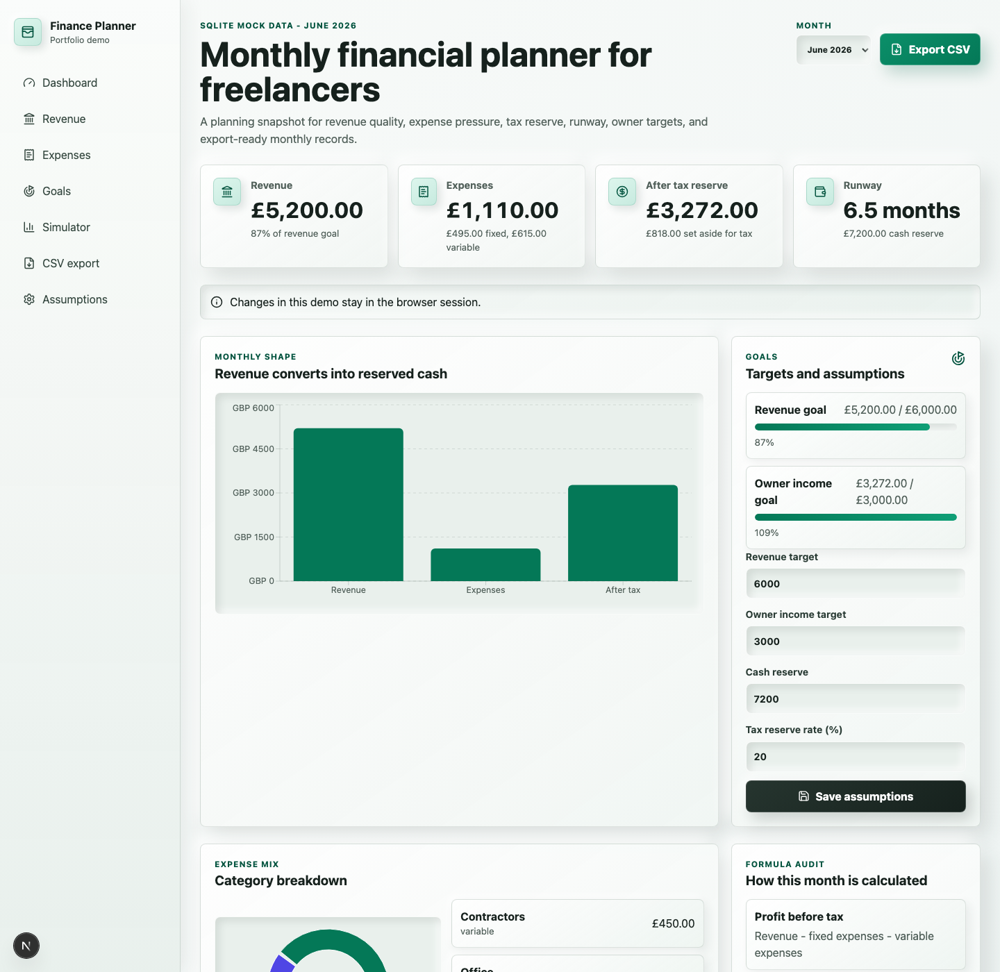

# Finance Planner MicroSaaS

Portfolio-ready financial planning dashboard for freelancers, consultants, and
small service businesses.

The project shows how monthly revenue turns into expenses, profit, tax reserve,
cash runway, owner income progress, and exportable records. It is intentionally
small, public, and easy to review: no authentication, no billing, no remote
database, and no private financial data.



## Why This Project Exists

Freelancers often see money entering the bank account before they understand how
much is safe to keep, pay themselves, or reserve for tax. This demo turns that
problem into a focused product surface:

- clear monthly KPIs;
- fixed and variable expense visibility;
- tax reserve and runway calculations;
- owner income and revenue goals;
- a target-income simulator;
- CSV export for spreadsheet review.

The goal is not to clone accounting software. The goal is to demonstrate product
thinking, financial calculation discipline, responsive UI polish, and a
reviewable full-stack architecture in a public GitHub repository.

## Portfolio Highlights

What a reviewer should notice:

- **Polished dashboard UI:** modern soft-neumorphic visual system, readable KPIs,
  responsive layouts, accessible focus states, and mobile overflow checks.
- **Real product scope:** the app solves one concrete freelancer planning problem
  instead of pretending to be a full accounting platform.
- **Safe public demo:** all records are synthetic and loaded from in-memory
  SQLite, so the app runs without secrets or hosted infrastructure.
- **Auditable calculations:** money is stored in integer minor units and core
  formulas are isolated in tested TypeScript modules.
- **Practical exports:** the dashboard and CSV route read the same mock monthly
  model.
- **Future SaaS path documented:** Supabase/PostgreSQL migrations are included
  only as optional reference material, not runtime dependencies.

## Current Demo Scope

Implemented:

- Monthly dashboard with revenue, expenses, after-tax reserve, and runway cards.
- Revenue, expense, category, goal, and assumption forms stored in browser state.
- Revenue vs expenses vs after-tax cash chart.
- Expense category breakdown chart and list.
- Revenue and owner-income progress indicators.
- Target-income simulator for monthly sales planning.
- CSV export at `/api/exports/monthly?month=YYYY-MM`.
- Month selector backed by synthetic SQLite demo months.
- Unit tests for calculations and CSV helpers.
- Playwright E2E tests for desktop and mobile dashboard behavior.

Deliberately not included:

- real customer data;
- Supabase as a runtime dependency;
- authentication;
- billing;
- bank feeds;
- invoicing;
- PDF generation;
- accounting, legal, tax, or investment advice.

## Tech Stack

| Area | Choice |
| --- | --- |
| Framework | Next.js App Router |
| Language | TypeScript |
| Demo data | In-memory SQLite with synthetic seed records |
| Validation | Zod |
| Charts | Recharts |
| Icons | Lucide React |
| Unit tests | Vitest |
| E2E tests | Playwright |
| Optional future path | Supabase/PostgreSQL migrations documented under `supabase/` |

## Quick Start

```bash
npm install
npm run dev
```

Open:

```text
http://127.0.0.1:3000/dashboard
```

The current demo does not require `.env.local`, Supabase credentials, or a
remote database.

## Verification

```bash
npm run lint
npm run typecheck
npm run test
npm run build
npm run test:e2e
```

`npm run test:e2e` starts the Next.js dev server through Playwright and runs the
dashboard checks in desktop Chromium and mobile Chrome.

## Project Map

```text
app/
  (app)/dashboard/          Dashboard route
  (app)/layout.tsx          Product shell and navigation
  api/exports/monthly/      CSV export route
  api/reports/monthly/      PDF placeholder route

features/
  dashboard/                Dashboard client UI and view model
  reports/                  CSV rendering
  shared/                   Display formatting

lib/
  calculations/             Pure money, tax, runway, summary, simulator logic
  database/                 Synthetic in-memory SQLite demo data
  validation/               Shared route/input schemas

supabase/
  migrations/               Optional future hosted SaaS schema reference

tests/
  e2e/                      Playwright dashboard flows
  unit/                     Calculation and CSV tests
```

## Documentation

- [Product Spec](./docs/product-spec.md)
- [Architecture](./docs/architecture.md)
- [Data Model](./docs/data-model.md)
- [Financial Calculations](./docs/calculations.md)
- [API Contracts](./docs/api-contracts.md)
- [Security Notes](./docs/security.md)
- [Testing Strategy](./docs/testing-strategy.md)
- [Development Guide](./docs/development.md)
- [Roadmap](./docs/roadmap.md)
- [ADR 0001 - Public MVP Stack](./docs/adr/0001-public-mvp-stack.md)
- [ADR 0002 - SQLite Public Demo Scope](./docs/adr/0002-sqlite-public-demo-scope.md)

## Data And Privacy Model

The public app uses only synthetic seed data from
[`lib/database/demo-sqlite.ts`](./lib/database/demo-sqlite.ts). Browser form
edits are kept in local React state for the current session and are not
persisted.

The Supabase SQL files are included for architectural review and future
expansion. They are not required to install, run, test, or build this demo.

## Suggested GitHub Repository Metadata

Use this repository description:

```text
Portfolio-ready Next.js finance planning dashboard with TypeScript, SQLite demo data, tested calculations, CSV export, and responsive UI.
```

Suggested topics:

```text
nextjs typescript finance-dashboard portfolio-project sqlite playwright vitest recharts micro-saas
```

## Future Product Path

The next credible product steps would be recurring expense templates, CSV import,
better report design, and monthly close workflows. A hosted SaaS version would
need Supabase Auth, PostgreSQL persistence, RLS tests, and stricter security
review before storing real user-owned financial data.

## Disclaimer

This project is for financial planning and portfolio demonstration only. It is
not financial, tax, accounting, legal, or investment advice.
